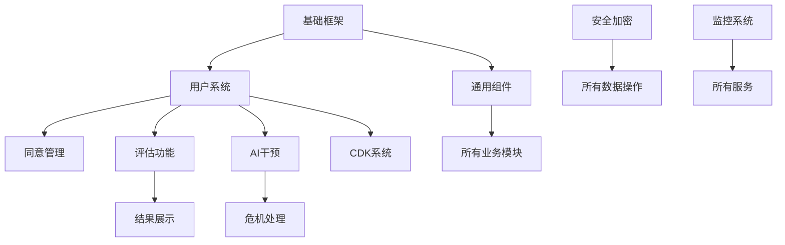

# CraneHeart 心理健康平台 - 详细开发周期计划

## 文档信息
- **版本**：v1.0.0
- **创建日期**：2025-10-20
- **项目起始**：2025-10-20（周一）
- **计划上线**：2026-01-23（周五）
- **总工期**：14周

## 目录

- [一、项目概览](#一项目概览)
- [二、团队组织](#二团队组织)
- [三、开发阶段详情](#三开发阶段详情)
  - [M0：基线对齐阶段](#m0基线对齐阶段)
  - [M1：MVP核心功能](#m1mvp核心功能)
  - [M2：合规与安全](#m2合规与安全)
  - [M3：运维与看板](#m3运维与看板)
  - [M4：GA验收阶段](#m4ga验收阶段)
- [四、周度计划明细](#四周度计划明细)
- [五、依赖关系图](#五依赖关系图)
- [六、风险管理计划](#六风险管理计划)
- [七、质量保证计划](#七质量保证计划)
- [八、发布计划](#八发布计划)

---

## 一、项目概览

### 1.1 项目定位
CraneHeart 是一个专注于心理健康筛查与干预的多端应用平台，提供标准化心理评估、AI智能干预、冥想练习等服务。

### 1.2 技术栈确认
- **前端**：uni-app + Vue 2.6 + uView 2.x
- **后端**：Node.js 16 LTS + uniCloud(阿里云)
- **数据库**：MongoDB + Supabase
- **AI服务**：OpenAI API (GPT-4/GPT-3.5)

### 1.3 核心功能范围
1. 用户认证与同意管理
2. 心理健康评估（PHQ-9/GAD-7）
3. AI个性化干预（CBT）
4. 冥想/正念内容
5. CDK兑换系统
6. 数据分析看板
7. 运营管理后台

### 1.4 里程碑概览

| 阶段 | 时间范围 | 工期 | 主要目标 |
|-----|---------|------|----------|
| M0 | 10.20-10.24 | 1周 | 基线对齐、架构设计 |
| M1 | 10.27-11.21 | 4周 | MVP核心功能开发 |
| M2 | 11.24-12.12 | 3周 | 合规与安全实施 |
| M3 | 12.15-01.09 | 4周 | 运维体系搭建 |
| M4 | 01.12-01.23 | 2周 | GA验收与上线 |

---

## 二、团队组织

### 2.1 建议团队配置

| 角色 | 人数 | 职责范围 |
|------|------|----------|
| 项目经理 | 1 | 项目管理、进度跟踪、风险控制 |
| 前端开发 | 2-3 | 小程序/H5开发、UI实现 |
| 后端开发 | 2 | 云函数开发、API接口 |
| 测试工程师 | 1 | 测试用例、自动化测试 |
| UI设计师 | 1 | 界面设计、交互设计 |
| 运维工程师 | 1 | 部署、监控、运维 |

### 2.2 工作机制
- **每日站会**：09:30，15分钟
- **周报提交**：每周五 17:00
- **代码评审**：每个PR必须有1人review
- **里程碑评审**：每阶段结束时进行

---

## 三、开发阶段详情

### M0：基线对齐阶段
**时间**：2025-10-20（周一）～ 2025-10-24（周五）  
**工期**：5个工作日

#### 目标
- 完成需求确认和技术方案设计
- 搭建开发环境和基础框架
- 制定开发规范和流程

#### 详细任务分解

##### Day 1-2 (10.20-10.21) - 需求与设计
| 任务 | 负责人 | 工时 | 交付物 |
|------|--------|------|--------|
| 需求文档评审与确认 | 全员 | 4h | 需求确认书 |
| 技术架构详细设计 | 架构师 | 8h | 架构设计文档 |
| 数据模型设计 | 后端 | 8h | 数据库设计文档 |
| API接口设计 | 后端 | 8h | API文档v1.0 |
| UI原型确认 | UI设计 | 8h | 原型图 |

##### Day 3-4 (10.22-10.23) - 环境搭建
| 任务 | 负责人 | 工时 | 交付物 |
|------|--------|------|--------|
| 开发环境配置 | 全员 | 4h | 环境配置文档 |
| 项目脚手架搭建 | 前端Lead | 8h | 基础项目结构 |
| uniCloud环境初始化 | 后端 | 4h | 云环境配置 |
| CI/CD流水线搭建 | 运维 | 8h | 自动化部署流程 |
| 代码规范配置 | 前端Lead | 4h | ESLint/Prettier配置 |

##### Day 5 (10.24) - 评审与准备
| 任务 | 负责人 | 工时 | 交付物 |
|------|--------|------|--------|
| M0成果评审 | 全员 | 2h | 评审报告 |
| M1任务分配 | PM | 2h | 任务分配表 |
| 开发规范培训 | Tech Lead | 2h | 规范文档 |
| 风险评估 | PM | 2h | 风险清单 |

#### M0 验收标准
- [x] 需求文档最终确认，无歧义
- [x] 技术架构文档完成，评审通过
- [x] 开发环境全员可用
- [x] 自动化流程搭建完成
- [x] 团队分工明确

---

### M1：MVP核心功能
**时间**：2025-10-27（周一）～ 2025-11-21（周五）  
**工期**：4周（20个工作日）

#### 目标
开发并完成所有核心功能，达到MVP标准

#### 周度计划

##### Week 1 (10.27-10.31) - 基础模块
| 模块 | 任务列表 | 负责人 | 预计工时 |
|------|----------|--------|----------|
| **用户系统** | | | |
| | 微信登录接入 | 前端A | 8h |
| | 用户认证云函数 | 后端A | 8h |
| | Token管理机制 | 后端A | 4h |
| | 用户信息存储 | 后端A | 4h |
| **同意管理** | | | |
| | 同意流程UI | 前端A | 8h |
| | 同意记录API | 后端A | 4h |
| | 版本管理机制 | 后端A | 4h |
| **基础组件** | | | |
| | 通用UI组件 | 前端B | 16h |
| | 请求封装 | 前端B | 8h |
| | 错误处理 | 前端B | 4h |
| | 路由守卫 | 前端B | 4h |

##### Week 2 (11.03-11.07) - 评估功能
| 模块 | 任务列表 | 负责人 | 预计工时 |
|------|----------|--------|----------|
| **量表功能** | | | |
| | 量表展示组件 | 前端A | 8h |
| | 答题导航功能 | 前端A | 8h |
| | 进度保存机制 | 前端A | 4h |
| | 量表数据管理 | 后端B | 8h |
| **评分系统** | | | |
| | 评分计算逻辑 | 后端B | 8h |
| | 风险等级判定 | 后端B | 4h |
| | 结果存储 | 后端B | 4h |
| **结果展示** | | | |
| | 结果页UI | 前端B | 8h |
| | 图表组件 | 前端B | 8h |
| | 建议文案展示 | 前端B | 4h |

##### Week 3 (11.10-11.14) - AI干预与CDK
| 模块 | 任务列表 | 负责人 | 预计工时 |
|------|----------|--------|----------|
| **AI干预** | | | |
| | 对话界面UI | 前端A | 12h |
| | AI网关搭建 | 后端A | 16h |
| | Prompt管理 | 后端A | 8h |
| | 对话记录存储 | 后端A | 4h |
| **危机处理** | | | |
| | 关键词检测 | 后端B | 8h |
| | 资源推送逻辑 | 后端B | 4h |
| | 紧急求助UI | 前端B | 4h |
| **CDK系统** | | | |
| | 兑换界面 | 前端B | 8h |
| | CDK验证API | 后端B | 8h |
| | 资源解锁逻辑 | 后端B | 4h |

##### Week 4 (11.17-11.21) - 集成测试
| 任务 | 负责人 | 预计工时 | 说明 |
|------|--------|----------|------|
| 功能集成测试 | 测试 | 16h | 全流程测试 |
| Bug修复 | 全员 | 24h | 优先级排序 |
| 性能优化 | 前端 | 8h | 首屏加载优化 |
| 接口联调 | 前后端 | 8h | 完整联调 |
| 代码审查 | Tech Lead | 8h | 代码质量检查 |
| M1验收准备 | PM | 4h | 准备演示 |

#### M1 交付物清单
- [ ] 用户登录注册功能
- [ ] 同意管理完整流程
- [ ] PHQ-9/GAD-7评估功能
- [ ] 评估结果展示
- [ ] AI基础对话功能
- [ ] CDK兑换功能
- [ ] 单元测试覆盖率 > 80%
- [ ] API文档更新完成

---

### M2：合规与安全
**时间**：2025-11-24（周一）～ 2025-12-12（周五）  
**工期**：3周（15个工作日）

#### 目标
实施安全措施，确保合规性，完善容错机制

#### 周度计划

##### Week 5 (11.24-11.28) - 安全基础
| 模块 | 任务列表 | 负责人 | 预计工时 |
|------|----------|--------|----------|
| **数据加密** | | | |
| | 传输加密实施 | 后端A | 8h |
| | 敏感字段加密 | 后端A | 12h |
| | 密钥管理系统 | 后端A | 8h |
| | 加密测试 | 测试 | 4h |
| **访问控制** | | | |
| | 权限系统实现 | 后端B | 12h |
| | API鉴权中间件 | 后端B | 8h |
| | 角色管理 | 后端B | 4h |

##### Week 6 (12.01-12.05) - 合规实施
| 模块 | 任务列表 | 负责人 | 预计工时 |
|------|----------|--------|----------|
| **日志审计** | | | |
| | 审计日志系统 | 后端A | 12h |
| | 日志脱敏处理 | 后端A | 8h |
| | 日志存储方案 | 运维 | 8h |
| **隐私保护** | | | |
| | 数据导出功能 | 前端A | 8h |
| | 数据删除流程 | 后端B | 8h |
| | 撤回同意功能 | 全栈 | 12h |
| **地区化资源** | | | |
| | 资源配置系统 | 后端B | 8h |
| | 本地化管理 | 前端B | 8h |

##### Week 7 (12.08-12.12) - 容错与降级
| 模块 | 任务列表 | 负责人 | 预计工时 |
|------|----------|--------|----------|
| **降级策略** | | | |
| | AI服务降级 | 后端A | 12h |
| | 离线功能支持 | 前端A | 12h |
| | 缓存策略实施 | 后端B | 8h |
| **异常处理** | | | |
| | 全局异常捕获 | 前端B | 8h |
| | 错误上报机制 | 前端B | 4h |
| | 用户友好提示 | 前端B | 4h |
| **安全测试** | | | |
| | 渗透测试 | 安全团队 | 16h |
| | 漏洞修复 | 全员 | 16h |
| | 合规审查 | PM | 8h |

#### M2 验收标准
- [ ] 数据加密全面实施
- [ ] 权限系统正常运行
- [ ] 审计日志完整记录
- [ ] 无高危安全漏洞
- [ ] 合规检查全部通过
- [ ] 降级策略测试通过

---

### M3：运维与看板
**时间**：2025-12-15（周一）～ 2026-01-09（周五）  
**工期**：4周（20个工作日，含元旦假期）

#### 目标
搭建完整的运维体系和数据分析平台

#### 周度计划

##### Week 8 (12.15-12.19) - 监控系统
| 模块 | 任务列表 | 负责人 | 预计工时 |
|------|----------|--------|----------|
| **基础监控** | | | |
| | 服务监控搭建 | 运维 | 16h |
| | 性能指标采集 | 运维 | 8h |
| | 告警规则配置 | 运维 | 8h |
| | 监控大屏开发 | 前端A | 16h |
| **业务监控** | | | |
| | 业务指标定义 | PM | 4h |
| | 数据采集点埋设 | 前端B | 12h |
| | 指标计算服务 | 后端A | 12h |

##### Week 9 (12.22-12.26) - 数据看板
| 模块 | 任务列表 | 负责人 | 预计工时 |
|------|----------|--------|----------|
| **管理后台** | | | |
| | 后台框架搭建 | 前端B | 12h |
| | 权限管理界面 | 前端B | 8h |
| | 用户管理界面 | 前端B | 8h |
| **数据可视化** | | | |
| | 图表组件开发 | 前端A | 16h |
| | 数据聚合API | 后端B | 12h |
| | 报表生成功能 | 后端B | 8h |

##### Week 10 (12.29-01.02) - 运营工具
*注：元旦假期，实际工作日3天*

| 模块 | 任务列表 | 负责人 | 预计工时 |
|------|----------|--------|----------|
| **内容管理** | | | |
| | 冥想内容管理 | 全栈A | 12h |
| | 资源上传功能 | 前端A | 8h |
| | CDK批量管理 | 后端A | 8h |
| **通知系统** | | | |
| | 通知模板管理 | 前端B | 8h |
| | 推送服务集成 | 后端B | 8h |

##### Week 11 (01.05-01.09) - 系统优化
| 任务 | 负责人 | 预计工时 | 说明 |
|------|--------|----------|------|
| 性能调优 | 后端 | 16h | 数据库优化、接口优化 |
| 前端优化 | 前端 | 16h | 打包优化、懒加载 |
| 运维文档 | 运维 | 8h | 完整运维手册 |
| 应急预案 | 运维 | 8h | 故障处理流程 |
| 知识转移 | 全员 | 8h | 内部培训 |

#### M3 验收标准
- [ ] 监控覆盖率 > 95%
- [ ] 关键指标实时展示
- [ ] 告警及时率 100%
- [ ] 管理后台功能完整
- [ ] 运维文档齐全
- [ ] 团队培训完成

---

### M4：GA验收阶段
**时间**：2026-01-12（周一）～ 2026-01-23（周五）  
**工期**：2周（10个工作日）

#### 目标
完成最终测试、优化和上线准备

#### 周度计划

##### Week 12 (01.12-01.16) - 全面测试
| 任务类型 | 具体内容 | 负责人 | 预计工时 |
|----------|----------|--------|----------|
| **功能测试** | | | |
| | 全功能回归测试 | 测试 | 16h |
| | 边界条件测试 | 测试 | 8h |
| | 兼容性测试 | 测试 | 8h |
| **性能测试** | | | |
| | 压力测试 | 测试 | 8h |
| | 负载测试 | 测试 | 8h |
| | 稳定性测试 | 测试 | 8h |
| **用户测试** | | | |
| | 内部试用 | 全员 | 8h |
| | 问题收集 | PM | 4h |
| | 体验优化 | 前端 | 12h |

##### Week 13 (01.19-01.23) - 上线准备
| 任务 | 负责人 | 预计工时 | 说明 |
|------|--------|----------|------|
| Bug修复 | 开发团队 | 24h | P0/P1问题清零 |
| 性能优化 | 全栈 | 16h | 关键路径优化 |
| 发布演练 | 运维 | 8h | 完整发布流程 |
| 回滚测试 | 运维 | 4h | 验证回滚机制 |
| 文档完善 | 全员 | 8h | 用户手册、API文档 |
| 上线评审 | 全员 | 4h | Go/No-Go决策 |
| 生产部署 | 运维 | 4h | 正式上线 |

#### M4 验收标准
- [ ] 功能测试通过率 100%
- [ ] 性能指标全部达标
- [ ] 崩溃率 < 0.1%
- [ ] P0/P1缺陷数为0
- [ ] 发布流程验证通过
- [ ] 所有文档更新完成

---

## 四、周度计划明细

### 项目周历总览

| 周次 | 日期范围 | 阶段 | 主要任务 | 关键交付 |
|------|----------|------|----------|----------|
| W1 | 10.20-10.24 | M0 | 基线对齐 | 架构设计、环境搭建 |
| W2 | 10.27-10.31 | M1 | 用户系统、基础组件 | 登录功能、同意管理 |
| W3 | 11.03-11.07 | M1 | 评估功能 | 量表系统、评分逻辑 |
| W4 | 11.10-11.14 | M1 | AI干预、CDK | 对话功能、兑换系统 |
| W5 | 11.17-11.21 | M1 | 集成测试 | MVP完成 |
| W6 | 11.24-11.28 | M2 | 安全基础 | 加密实施、权限系统 |
| W7 | 12.01-12.05 | M2 | 合规实施 | 审计日志、隐私保护 |
| W8 | 12.08-12.12 | M2 | 容错降级 | 降级策略、安全测试 |
| W9 | 12.15-12.19 | M3 | 监控系统 | 监控搭建、指标采集 |
| W10 | 12.22-12.26 | M3 | 数据看板 | 管理后台、数据可视化 |
| W11 | 12.29-01.02 | M3 | 运营工具 | 内容管理、通知系统 |
| W12 | 01.05-01.09 | M3 | 系统优化 | 性能优化、文档完善 |
| W13 | 01.12-01.16 | M4 | 全面测试 | 功能/性能/用户测试 |
| W14 | 01.19-01.23 | M4 | 上线准备 | 最终优化、正式发布 |

### 每日站会议题模板

```markdown
## 日期：2025-XX-XX
### 昨日完成
- [ ] 任务1...
- [ ] 任务2...

### 今日计划
- [ ] 任务1...
- [ ] 任务2...

### 遇到问题
- 问题1：描述及需要的支持
- 问题2：...

### 风险提示
- 风险1：可能影响...
```

---

## 五、依赖关系图

### 5.1 模块依赖关系



### 5.2 关键路径分析

1. **用户系统** → 所有功能的基础，必须最先完成
2. **评估功能** → 核心业务功能，优先级最高  
3. **AI干预** → 差异化功能，需要充足测试时间
4. **安全合规** → 贯穿全程，不能延后
5. **监控运维** → 上线前必须就绪

### 5.3 并行开发建议

| 可并行任务组 | 前置条件 | 建议安排 |
|-------------|----------|----------|
| 前端UI组件 + 后端API框架 | 设计稿确认 | W2同时启动 |
| 评估功能 + CDK系统 | 用户系统完成 | W3-W4并行 |
| 监控系统 + 管理后台 | 核心功能完成 | W9-W10并行 |
| 文档编写 + 测试用例 | 功能开发中 | 持续进行 |

---

## 六、风险管理计划

### 6.1 风险识别与应对

| 风险类别 | 具体风险 | 可能性 | 影响度 | 缓解措施 | 应急预案 |
|---------|---------|--------|--------|----------|----------|
| **技术风险** | | | | | |
| | AI服务不稳定 | 中 | 高 | 1.实现降级策略<br>2.准备本地模型 | 切换备用服务 |
| | 性能瓶颈 | 中 | 中 | 1.提前压测<br>2.代码优化 | 扩容/限流 |
| | 第三方依赖故障 | 低 | 高 | 1.关键服务冗余<br>2.版本锁定 | 快速切换 |
| **进度风险** | | | | | |
| | 需求变更 | 中 | 中 | 1.变更控制流程<br>2.预留缓冲时间 | 调整范围 |
| | 人员变动 | 低 | 中 | 1.知识文档化<br>2.交叉培训 | 快速补充 |
| | 集成延误 | 中 | 中 | 1.持续集成<br>2.每日同步 | 加班赶工 |
| **合规风险** | | | | | |
| | 法规变化 | 低 | 高 | 1.持续关注<br>2.专家咨询 | 快速调整 |
| | 数据泄露 | 低 | 极高 | 1.安全审计<br>2.加密存储 | 应急响应 |
| **运营风险** | | | | | |
| | 用户接受度低 | 中 | 中 | 1.用户调研<br>2.MVP验证 | 快速迭代 |
| | 运维事故 | 低 | 高 | 1.自动化运维<br>2.应急预案 | 快速恢复 |

### 6.2 风险监控机制

1. **每周风险评审**：周五下午进行
2. **风险登记表**：实时更新，责任到人
3. **预警机制**：提前2周预警高风险项
4. **升级路径**：技术问题→Tech Lead→PM→管理层

---

## 七、质量保证计划

### 7.1 质量标准

| 质量维度 | 具体指标 | 目标值 | 测量方法 |
|---------|---------|--------|----------|
| **代码质量** | | | |
| | 单测覆盖率 | >80% | Jest覆盖率报告 |
| | 代码复杂度 | <15 | ESLint检测 |
| | 代码重复率 | <5% | Sonar扫描 |
| **性能指标** | | | |
| | 首屏加载 | <2s | 真机测试 |
| | API响应 | <500ms | 压测工具 |
| | 内存占用 | <100MB | 性能监控 |
| **稳定性** | | | |
| | 崩溃率 | <0.1% | 错误监控 |
| | 可用性 | >99.9% | 监控系统 |
| | 错误率 | <1% | 日志分析 |

### 7.2 测试计划

#### 7.2.1 测试策略分层

```
        E2E测试 (10%)
       /            \
    集成测试 (20%)    
   /              \
单元测试 (70%)     
```

#### 7.2.2 测试时间安排

| 测试类型 | 执行时机 | 负责人 | 工具 |
|---------|---------|--------|------|
| 单元测试 | 提交代码时 | 开发者 | Jest |
| 集成测试 | 每日构建 | 测试团队 | Postman |
| E2E测试 | 迭代结束 | 测试团队 | Cypress |
| 性能测试 | M1/M4阶段 | 测试团队 | JMeter |
| 安全测试 | M2阶段 | 安全团队 | OWASP |

### 7.3 代码评审规范

1. **评审时机**：每个PR合并前
2. **评审要点**：
   - 功能完整性
   - 代码规范性
   - 性能考虑
   - 安全隐患
   - 测试覆盖
3. **评审标准**：至少1人approve才能合并

---

## 八、发布计划

### 8.1 发布策略

#### 8.1.1 发布阶段

| 阶段 | 时间 | 范围 | 目标 |
|------|------|------|------|
| Alpha | W5结束 | 内部测试 | 功能验证 |
| Beta | W8结束 | 受邀用户 | 收集反馈 |
| RC | W12结束 | 小范围 | 稳定性验证 |
| GA | W14结束 | 全量发布 | 正式上线 |

#### 8.1.2 灰度发布计划

```
Day 1: 1% 用户
Day 3: 5% 用户  
Day 5: 20% 用户
Day 7: 50% 用户
Day 10: 100% 用户
```

### 8.2 发布检查清单

#### 8.2.1 发布前检查

- [ ] 所有P0/P1缺陷已修复
- [ ] 性能指标达标
- [ ] 安全扫描通过
- [ ] 文档更新完成
- [ ] 回滚方案就绪
- [ ] 监控告警配置
- [ ] 客服培训完成

#### 8.2.2 发布后验证

- [ ] 核心功能可用
- [ ] 监控指标正常
- [ ] 无异常告警
- [ ] 用户反馈收集
- [ ] 数据备份完成

### 8.3 回滚计划

1. **回滚触发条件**：
   - 崩溃率 > 1%
   - 核心功能故障
   - 数据异常
   - 安全事件

2. **回滚流程**：
   - T+0: 发现问题
   - T+5min: 评估影响
   - T+10min: 执行回滚
   - T+15min: 验证恢复
   - T+30min: 发布公告

---

## 附录

### A. 会议安排

| 会议类型 | 频率 | 时间 | 参与人 | 时长 |
|---------|------|------|--------|------|
| 每日站会 | 每天 | 09:30 | 全员 | 15min |
| 周例会 | 每周一 | 14:00 | 全员 | 1h |
| 需求评审 | 按需 | - | 相关人员 | 2h |
| 技术评审 | 每周三 | 15:00 | 技术团队 | 1h |
| 里程碑评审 | 阶段末 | - | 全员+管理层 | 2h |

### B. 工具清单

| 用途 | 工具 | 说明 |
|------|------|------|
| 项目管理 | TAPD/Jira | 任务跟踪 |
| 代码管理 | Git | 版本控制 |
| 文档协作 | 语雀/Wiki | 知识管理 |
| 设计协作 | Figma | UI设计 |
| API文档 | Swagger | 接口文档 |
| 沟通协作 | 企业微信 | 即时通讯 |

### C. 联系人列表

| 角色 | 姓名 | 联系方式 | 备注 |
|------|------|----------|------|
| 项目经理 | 待定 | - | 总负责人 |
| 技术负责人 | 待定 | - | 技术决策 |
| 产品负责人 | 待定 | - | 需求确认 |
| 测试负责人 | 待定 | - | 质量保证 |
| 运维负责人 | 待定 | - | 部署运维 |

### D. 参考资源

1. [需求文档](./CraneHeart需求文档.md)
2. [架构设计](./CraneHeart架构计划.md)
3. [API文档](./docs/api.md)
4. [部署手册](./docs/deployment.md)
5. [运维手册](./docs/operations.md)

---

**文档维护说明**：
- 本文档每周更新一次
- 重大变更需要评审
- 保持与实际进度同步
- 问题反馈请联系项目经理

**最后更新**：2025-10-20  
**下次评审**：2025-10-24
