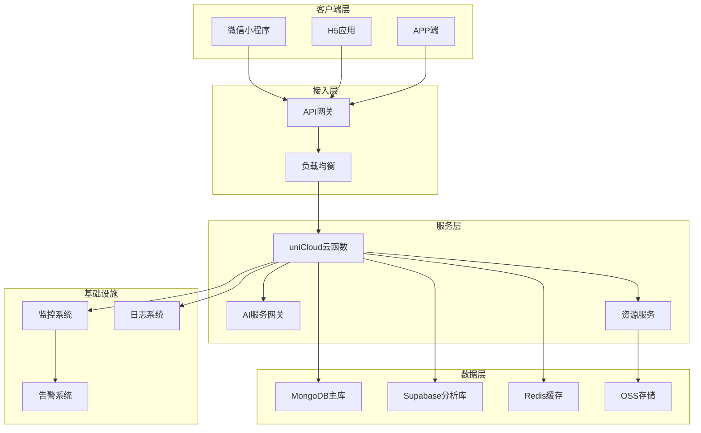
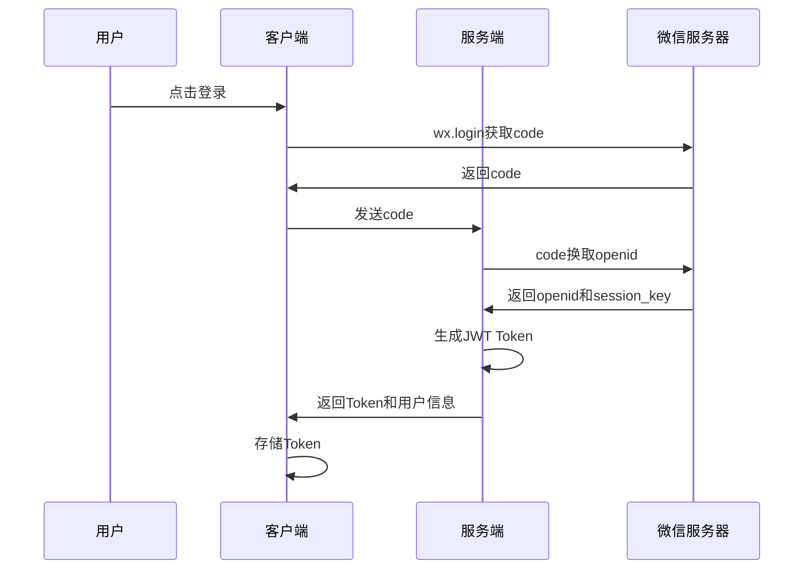
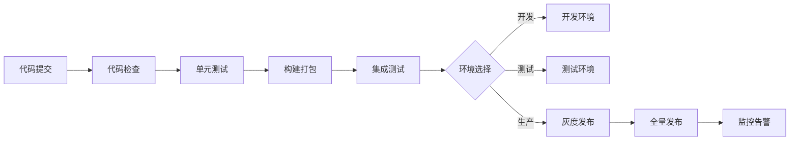
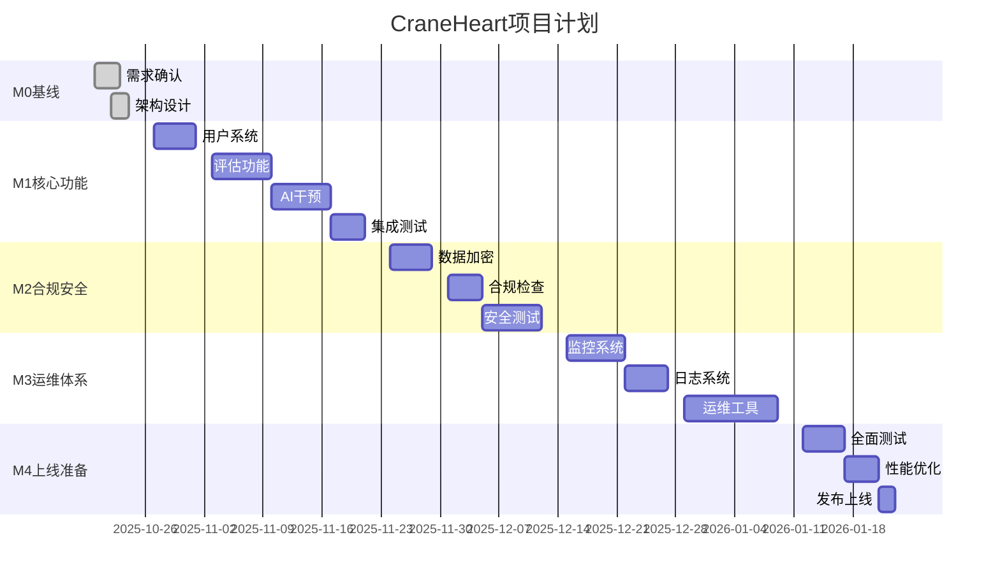

# CraneHeart 心理健康平台 - 详细架构计划

## 目录

- [一、项目概述](#一项目概述)
- [二、技术架构](#二技术架构)
- [三、目录结构规划](#三目录结构规划)
- [四、核心模块设计](#四核心模块设计)
- [五、数据模型设计](#五数据模型设计)
- [六、API设计规范](#六api设计规范)
- [七、安全架构](#七安全架构)
- [八、部署架构](#八部署架构)
- [九、开发规范](#九开发规范)
- [十、测试策略](#十测试策略)
- [十一、监控与运维](#十一监控与运维)
- [十二、项目时间线](#十二项目时间线)

---

## 一、项目概述

### 1.1 项目定位

CraneHeart 是一个专注于心理健康筛查与干预的多端应用平台，旨在为用户提供便捷的心理健康评估、AI 智能干预、冥想练习等服务。

### 1.2 核心价值

- **早期筛查**：通过标准化量表（PHQ-9/GAD-7）进行心理健康筛查
- **智能干预**：基于 CBT 的 AI 个性化心理干预
- **隐私保护**：严格的数据隐私保护和合规管理
- **多模态评估**：支持文本、语音等多种评估方式

### 1.3 目标用户

- **主要用户**：需要心理健康支持的个人用户
- **家长用户**：关注子女心理健康的家长
- **运营人员**：平台运营和管理人员

---

## 二、技术架构

### 2.1 整体架构图



### 2.2 技术栈详情

#### 2.2.1 前端技术栈

```yaml
框架基础:
  - uni-app: 多端统一开发框架
  - Vue: 2.6.x (Options API)
  - uView: 2.x UI组件库

工具链:
  - HBuilderX: IDE
  - npm: 包管理器
  - webpack: 构建工具

代码规范:
  - ESLint: 代码检查
  - Prettier: 代码格式化
  - husky: Git hooks

运行端：
  - mp-weixin

```

#### 2.2.2 后端技术栈

```yaml
运行环境:
  - Node.js: 16 LTS
  - 模块系统: CommonJS

云服务:
  - uniCloud: 阿里云版本
  - PostgreSQL（Supabase）: 主数据库
  - Redis: 缓存服务

AI服务:
  - OpenAI API: GPT-4/GPT-3.5
  - 本地模型: 降级备用
```

### 2.3 架构原则

1. **安全优先**：所有设计决策优先考虑数据安全和隐私保护
2. **高可用性**：支持降级策略，确保核心功能始终可用
3. **模块化设计**：功能模块松耦合，便于独立开发和维护
4. **性能优化**：离线优先，减少网络请求，提升用户体验
5. **合规性**：符合个人信息保护法等相关法规要求

---

## 三、目录结构规划

### 3.1 前端目录结构

```
├── api/                      # API接口层
│   ├── modules/             # 模块化API
│   │   ├── user.js         # 用户相关
│   │   ├── assessment.js   # 评估相关
│   │   ├── intervention.js # 干预相关
│   │   └── ...
│   ├── request.js          # 请求封装
│   └── interceptor.js      # 拦截器
├── components/              # 组件目录
│   ├── common/             # 通用组件
│   ├── business/           # 业务组件
│   └── layouts/            # 布局组件
├── pages/                   # 页面目录
│   ├── index/              # 首页
│   ├── assessment/         # 评估模块
│   ├── intervention/       # 干预模块
│   ├── user/               # 用户中心
│   └── ...
├── store/                   # 状态管理
│   ├── modules/            # 模块化store
│   └── index.js
├── utils/                   # 工具函数
│   ├── auth.js             # 认证相关
│   ├── crypto.js           # 加密工具
│   ├── validator.js        # 验证工具
│   └── ...
├── static/                  # 静态资源
│   ├── images/
│   ├── audio/
│   └── scales/             # 量表数据
├── config/                  # 配置文件
│   ├── app.config.js       # 应用配置
│   ├── api.config.js       # API配置
│   └── env.js              # 环境配置
└── mixins/                  # 混入文件
```

### 3.2 后端目录结构

```
uniCloud-aliyun/
├── cloudfunctions/          # 云函数目录
│   ├── common/             # 公共模块
│   │   ├── auth/          # 认证模块
│   │   ├── db/            # 数据库操作
│   │   └── utils/         # 工具函数
│   ├── user/               # 用户服务
│   ├── assessment/         # 评估服务
│   ├── intervention/       # 干预服务
│   ├── admin/              # 管理服务
│   └── ...
├── database/                # 数据库配置
│   ├── db_init.json        # 初始化脚本
│   └── schema/             # 数据模型
└── config/                  # 配置文件
```

---

## 四、核心模块设计

### 4.1 用户认证模块

#### 4.1.1 功能设计

```javascript
// 认证流程
class AuthService {
  // 微信登录
  async wechatLogin(code) {
    // 1. 获取openid
    // 2. 查询/创建用户
    // 3. 生成token
    // 4. 返回用户信息
  }
  
  // Token刷新
  async refreshToken(refreshToken) {
    // 1. 验证refreshToken
    // 2. 生成新的accessToken
    // 3. 更新refreshToken
  }
  
  // 退出登录
  async logout(userId) {
    // 1. 清除token
    // 2. 记录日志
  }
}
```

#### 4.1.2 同意管理

```javascript
// 同意管理服务
class ConsentService {
  // 记录同意
  async recordConsent(userId, consentData) {
    // 1. 验证同意项
    // 2. 记录版本和时间戳
    // 3. 存储同意记录
  }
  
  // 撤回同意
  async revokeConsent(userId, consentType) {
    // 1. 验证撤回请求
    // 2. 更新同意状态
    // 3. 触发数据处理流程
  }
}
```

### 4.2 评估模块

#### 4.2.1 量表管理

```javascript
// 量表服务
class ScaleService {
  // 获取量表
  async getScale(scaleId, version) {
    // 1. 从缓存获取
    // 2. 验证版本
    // 3. 返回量表数据
  }
  
  // 提交答案
  async submitAnswers(userId, scaleId, answers) {
    // 1. 验证答案完整性
    // 2. 计算得分
    // 3. 评估风险等级
    // 4. 保存结果
  }
  
  // 多模态评估
  async multiModalAssessment(userId, data) {
    // 1. 文本评估
    // 2. 语音特征提取（可选）
    // 3. 行为模式分析（可选）
    // 4. 综合风险评分
  }
}
```

#### 4.2.2 语音处理

```javascript
// 语音处理服务
class VoiceService {
  // 处理语音
  async processVoice(audioBuffer) {
    // 1. 特征提取（本地）
    // 2. 删除原音频
    // 3. 上传特征数据
    // 4. 返回分析结果
  }
  
  // 特征提取
  extractFeatures(audioBuffer) {
    // 1. 能量特征
    // 2. 基频特征
    // 3. MFCC特征
    // 4. 抖动特征
  }
}
```

### 4.3 AI干预模块

#### 4.3.1 对话管理

```javascript
// AI对话服务
class InterventionService {
  // CBT对话流程
  async startCBTSession(userId, emotion) {
    // 1. 初始化会话
    // 2. 情绪命名
    // 3. 证据收集
    // 4. 认知重评
    // 5. 行动计划
  }
  
  // 危机干预
  async crisisIntervention(userId, content) {
    // 1. 关键词检测
    // 2. 风险评估
    // 3. 资源推送
    // 4. 人工预警
  }
}
```

#### 4.3.2 AI网关

```javascript
// AI网关服务
class AIGateway {
  // 统一请求处理
  async request(params) {
    try {
      // 1. 限流检查
      // 2. 模型选择
      // 3. 发送请求
      // 4. 响应处理
    } catch (error) {
      // 降级处理
      return this.fallback(params);
    }
  }
  
  // 降级策略
  async fallback(params) {
    // 1. 缓存查询
    // 2. 模板回复
    // 3. 本地模型
  }
}
```

### 4.4 内容管理模块

#### 4.4.1 冥想内容

```javascript
// 冥想内容服务
class MeditationService {
  // 获取内容列表
  async getContentList(userId) {
    // 1. 获取用户权限
    // 2. 筛选可用内容
    // 3. 个性化推荐
  }
  
  // 内容播放
  async playContent(userId, contentId) {
    // 1. 验证权限
    // 2. 记录播放
    // 3. 返回资源URL
  }
}
```

### 4.5 CDK系统

```javascript
// CDK服务
class CDKService {
  // 兑换CDK
  async redeem(userId, code) {
    // 1. 验证CDK
    // 2. 检查使用状态
    // 3. 解锁资源
    // 4. 记录兑换
  }
  
  // 生成CDK
  async generate(config) {
    // 1. 生成唯一码
    // 2. 配置资源
    // 3. 设置有效期
  }
}
```

---

## 五、数据模型设计

### 5.1 用户数据模型

```javascript
// 用户表 (users)
{
  "_id": "ObjectId",
  "uid": "String",              // 用户唯一ID
  "openid": "String",           // 微信openid（加密存储）
  "profile": {
    "nickname": "String",       // 昵称
    "avatar": "String",         // 头像
    "gender": "Number",         // 性别
    "birthYear": "Number"       // 出生年份
  },
  "consent": {
    "version": "String",        // 同意版本
    "timestamp": "Date",        // 同意时间
    "items": {                  // 同意项
      "text": "Boolean",
      "voice": "Boolean",
      "behavior": "Boolean"
    }
  },
  "status": "Number",           // 账号状态
  "createdAt": "Date",
  "updatedAt": "Date"
}

// 评估记录表 (assessments)
{
  "_id": "ObjectId",
  "uid": "String",              // 用户ID
  "scaleId": "String",          // 量表ID
  "type": "String",             // 评估类型
  "answers": "Array",           // 答案数组
  "score": "Number",            // 得分
  "level": "Number",            // 风险等级
  "multiModal": {               // 多模态数据
    "voice": {
      "features": "Object",     // 声学特征
      "processed": "Boolean"    // 处理状态
    },
    "behavior": "Object"        // 行为数据
  },
  "riskScore": "Number",        // 综合风险分
  "timestamp": "Date",
  "duration": "Number"          // 完成时长
}

// 干预记录表 (interventions)
{
  "_id": "ObjectId",
  "uid": "String",
  "sessionId": "String",        // 会话ID
  "type": "String",             // 干预类型
  "emotion": "String",          // 情绪标签
  "messages": [{                // 对话记录
    "role": "String",
    "content": "String",
    "timestamp": "Date"
  }],
  "summary": "String",          // 总结
  "status": "String",           // 完成状态
  "createdAt": "Date"
}
```

### 5.2 内容数据模型

```javascript
// 冥想内容表 (meditations)
{
  "_id": "ObjectId",
  "contentId": "String",
  "title": "String",
  "description": "String",
  "category": "String",         // 分类
  "tags": "Array",              // 标签
  "duration": "Number",         // 时长
  "audioUrl": "String",         // 音频地址
  "coverUrl": "String",         // 封面
  "isFree": "Boolean",          // 是否免费
  "order": "Number",            // 排序
  "status": "Number",           // 状态
  "createdAt": "Date"
}

// CDK表 (cdks)
{
  "_id": "ObjectId",
  "code": "String",             // 兑换码
  "type": "String",             // 类型
  "resources": "Array",         // 解锁资源
  "expiresAt": "Date",          // 过期时间
  "maxUse": "Number",           // 最大使用次数
  "usedCount": "Number",        // 已使用次数
  "usedBy": "Array",            // 使用记录
  "status": "Number",           // 状态
  "createdAt": "Date"
}
```

### 5.3 运营数据模型

```javascript
// 事件日志表 (event_logs)
{
  "_id": "ObjectId",
  "uid": "String",
  "event": "String",            // 事件类型
  "data": "Object",             // 事件数据
  "ip": "String",               // IP地址（脱敏）
  "device": "Object",           // 设备信息
  "timestamp": "Date"
}

// 统计聚合表 (statistics)
{
  "_id": "ObjectId",
  "date": "String",             // 日期
  "type": "String",             // 统计类型
  "metrics": {                  // 指标数据
    "dau": "Number",
    "assessments": "Number",
    "interventions": "Number",
    "riskDistribution": "Object"
  },
  "createdAt": "Date"
}
```

---

## 六、API设计规范

### 6.1 API命名规范

```yaml
规范说明:
  - RESTful风格设计
  - 使用小写字母和连字符
  - 动词使用HTTP方法表达
  - 资源使用名词复数

示例:
  GET    /api/v1/users/{id}          # 获取用户信息
  POST   /api/v1/assessments         # 提交评估
  PUT    /api/v1/users/{id}/consent  # 更新同意
  DELETE /api/v1/sessions/{id}       # 删除会话
```

### 6.2 请求响应格式

#### 6.2.1 请求格式

```javascript
// 请求头
{
  "Content-Type": "application/json",
  "Authorization": "Bearer <token>",
  "X-Request-ID": "uuid",
  "X-App-Version": "1.0.0",
  "X-Platform": "mp-weixin"
}

// 请求体
{
  "data": {
    // 业务数据
  },
  "timestamp": 1634567890000,
  "sign": "签名"
}
```

#### 6.2.2 响应格式

```javascript
// 成功响应
{
  "code": 0,
  "message": "success",
  "data": {
    // 返回数据
  },
  "timestamp": 1634567890000,
  "requestId": "uuid"
}

// 错误响应
{
  "code": 40001,
  "message": "参数错误",
  "error": {
    "field": "email",
    "reason": "格式不正确"
  },
  "timestamp": 1634567890000,
  "requestId": "uuid"
}
```

### 6.3 核心API列表

#### 6.3.1 用户相关

| API | 方法 | 说明 | 权限 |
|-----|------|------|------|
| /api/v1/auth/login | POST | 用户登录 | 公开 |
| /api/v1/auth/refresh | POST | 刷新Token | Token |
| /api/v1/users/profile | GET | 获取用户信息 | 登录 |
| /api/v1/users/consent | PUT | 更新同意 | 登录 |

#### 6.3.2 评估相关

| API | 方法 | 说明 | 权限 |
|-----|------|------|------|
| /api/v1/scales | GET | 获取量表列表 | 登录 |
| /api/v1/assessments | POST | 提交评估 | 登录 |
| /api/v1/assessments/{id} | GET | 获取评估结果 | 登录 |
| /api/v1/assessments/history | GET | 评估历史 | 登录 |

#### 6.3.3 干预相关

| API | 方法 | 说明 | 权限 |
|-----|------|------|------|
| /api/v1/interventions/start | POST | 开始干预 | 登录 |
| /api/v1/interventions/chat | POST | 对话交互 | 登录 |
| /api/v1/interventions/{id} | GET | 获取会话 | 登录 |

---

## 七、安全架构

### 7.1 身份认证



### 7.2 数据加密

#### 7.2.1 传输加密

- HTTPS全链路加密
- TLS 1.2+
- 证书固定（Certificate Pinning）

#### 7.2.2 存储加密

```javascript
// 敏感字段加密
const encryptedFields = {
  phone: encrypt(AES256, phone, fieldKey),
  email: encrypt(AES256, email, fieldKey),
  realName: encrypt(AES256, name, fieldKey),
  idCard: encrypt(AES256, idCard, fieldKey)
};

// 密钥管理
const keyRotation = {
  interval: 90, // 天
  algorithm: 'AES-256-GCM',
  storage: 'KMS'
};
```

### 7.3 访问控制

#### 7.3.1 权限模型

```yaml
角色定义:
  - guest: 访客用户
  - user: 普通用户
  - vip: 付费用户
  - admin: 管理员

权限矩阵:
  guest:
    - 浏览公开内容
    - 查看功能介绍
  user:
    - 所有guest权限
    - 使用评估功能
    - 使用基础干预
    - 查看历史记录
  vip:
    - 所有user权限
    - 解锁高级内容
    - 优先AI服务
  admin:
    - 所有权限
    - 后台管理
```

### 7.4 安全审计

```javascript
// 审计日志记录
class AuditLogger {
  log(event) {
    const record = {
      timestamp: new Date(),
      userId: event.userId,
      action: event.action,
      resource: event.resource,
      result: event.result,
      ip: maskIP(event.ip),
      device: event.device,
      risk: calculateRisk(event)
    };
    
    // 异步写入
    this.writeToStorage(record);
    
    // 高风险告警
    if (record.risk > 0.8) {
      this.alert(record);
    }
  }
}
```

---

## 八、部署架构

### 8.1 部署拓扑

```yaml
生产环境:
  地域: 华东2（上海）
  可用区: 多可用区部署
  
  服务部署:
    - uniCloud: 主服务
    - CDN: 静态资源加速
    - OSS: 文件存储
    - Redis: 缓存集群
    
  容灾策略:
    - 异地备份
    - 自动故障转移
    - 定期演练
```

### 8.2 CI/CD流程



### 8.3 环境配置

```javascript
// 环境变量配置
const config = {
  development: {
    apiUrl: 'https://dev-api.craneheart.com',
    debug: true,
    logLevel: 'debug'
  },
  staging: {
    apiUrl: 'https://test-api.craneheart.com',
    debug: false,
    logLevel: 'info'
  },
  production: {
    apiUrl: 'https://api.craneheart.com',
    debug: false,
    logLevel: 'error'
  }
};
```

---

## 九、开发规范

### 9.1 代码规范

#### 9.1.1 命名规范

```javascript
// 文件命名：kebab-case
user-profile.vue
api-request.js

// 组件命名：PascalCase
export default {
  name: 'UserProfile'
}

// 方法命名：camelCase
methods: {
  getUserInfo() {},
  handleSubmit() {}
}

// 常量命名：UPPER_SNAKE_CASE
const MAX_RETRY_COUNT = 3;
const API_TIMEOUT = 5000;
```

#### 9.1.2 组件规范

```vue
<template>
  <!-- 模板规范 -->
  <view class="container">
    <!-- 使用语义化标签 -->
    <view class="header">
      <!-- 组件注释 -->
    </view>
  </view>
</template>

<script>
// 引入顺序：第三方库 > 项目组件 > 工具函数
import { mapState } from 'vuex';
import NavBar from '@/components/common/NavBar';
import { formatDate } from '@/utils';

export default {
  name: 'PageName',
  
  // 组件选项顺序
  components: {},
  mixins: [],
  props: {},
  data() {
    return {};
  },
  computed: {},
  watch: {},
  created() {},
  mounted() {},
  methods: {},
  destroyed() {}
};
</script>

<style lang="scss" scoped>
/* 样式规范 */
.container {
  /* 布局属性 */
  display: flex;
  
  /* 盒模型 */
  padding: 20rpx;
  
  /* 视觉效果 */
  background: #fff;
}
</style>
```

### 9.2 Git规范

#### 9.2.1 分支管理

```bash
# 分支命名
master          # 主分支
develop         # 开发分支
feature/xxx     # 功能分支
bugfix/xxx      # 修复分支
hotfix/xxx      # 紧急修复
release/x.x.x   # 发布分支
```

#### 9.2.2 提交规范

```bash
# 提交格式
<type>(<scope>): <subject>

# 类型说明
feat: 新功能
fix: 修复bug
docs: 文档更新
style: 代码格式
refactor: 重构
test: 测试相关
chore: 构建/工具

# 示例
feat(auth): 添加微信登录功能
fix(assessment): 修复评分计算错误
docs(readme): 更新部署文档
```

### 9.3 注释规范

```javascript
/**
 * 用户登录
 * @param {string} code - 微信登录code
 * @returns {Promise<Object>} 用户信息和token
 * @throws {Error} 登录失败错误
 */
async function login(code) {
  // 单行注释说明具体逻辑
  
  /* 
   * 多行注释说明复杂逻辑
   * 1. 第一步...
   * 2. 第二步...
   */
}
```

---

## 十、测试策略

### 10.1 测试分层

```yaml
测试金字塔:
  单元测试: 70%
    - 工具函数测试
    - 组件测试
    - API测试
    
  集成测试: 20%
    - 模块集成测试
    - API集成测试
    - 数据库测试
    
  E2E测试: 10%
    - 核心流程测试
    - 用户场景测试
```

### 10.2 测试用例

#### 10.2.1 单元测试示例

```javascript
// 评分计算测试
describe('ScoreCalculator', () => {
  test('PHQ-9评分计算', () => {
    const answers = [0, 1, 2, 3, 0, 1, 2, 3, 0];
    const score = calculatePHQ9Score(answers);
    expect(score).toBe(12);
  });
  
  test('风险等级判定', () => {
    expect(getRiskLevel(4)).toBe('低风险');
    expect(getRiskLevel(10)).toBe('中风险');
    expect(getRiskLevel(15)).toBe('高风险');
  });
});
```

#### 10.2.2 E2E测试示例

```javascript
// 完整评估流程测试
describe('评估流程', () => {
  it('用户完成PHQ-9评估', async () => {
    // 1. 登录
    await login();
    
    // 2. 进入评估
    await navigateTo('/assessment');
    
    // 3. 回答问题
    for (let i = 0; i < 9; i++) {
      await selectAnswer(i, 1);
      await clickNext();
    }
    
    // 4. 查看结果
    await waitForResult();
    expect(getScore()).toBeGreaterThan(0);
  });
});
```

### 10.3 性能测试

```yaml
性能指标:
  响应时间:
    - API响应: P95 < 500ms
    - 页面加载: < 2s
    - 首屏时间: < 1s
    
  并发能力:
    - 并发用户: 1000+
    - QPS: 1000+
    
  稳定性:
    - 崩溃率: < 0.1%
    - 错误率: < 1%
```

---

## 十一、监控与运维

### 11.1 监控体系

#### 11.1.1 监控指标

```yaml
业务监控:
  - 用户活跃度 (DAU/MAU)
  - 功能使用率
  - 评估完成率
  - 干预效果

性能监控:
  - API响应时间
  - 页面加载时间
  - 错误率
  - 崩溃率

资源监控:
  - CPU使用率
  - 内存使用率
  - 带宽使用
  - 存储空间
```

#### 11.1.2 告警配置

```javascript
// 告警规则
const alertRules = [
  {
    name: 'API响应时间',
    metric: 'api.response.time',
    threshold: 1000, // ms
    duration: 300, // 5分钟
    severity: 'warning'
  },
  {
    name: '错误率',
    metric: 'error.rate',
    threshold: 0.05, // 5%
    duration: 60, // 1分钟
    severity: 'critical'
  }
];
```

### 11.2 日志管理

#### 11.2.1 日志分级

```javascript
// 日志级别
const LogLevel = {
  DEBUG: 0,   // 调试信息
  INFO: 1,    // 一般信息
  WARN: 2,    // 警告信息
  ERROR: 3,   // 错误信息
  FATAL: 4    // 致命错误
};

// 日志格式
{
  timestamp: '2025-10-20T10:00:00Z',
  level: 'INFO',
  service: 'assessment',
  userId: 'u_xxx',
  action: 'submit_assessment',
  data: {},
  duration: 123,
  traceId: 'xxx'
}
```

### 11.3 运维工具

```yaml
运维工具集:
  监控:
    - Prometheus: 指标收集
    - Grafana: 可视化
    - AlertManager: 告警管理
    
  日志:
    - ELK Stack: 日志分析
    - 日志归档: OSS存储
    
  部署:
    - Jenkins: CI/CD
    - Docker: 容器化
    - K8s: 编排管理
```

---

## 十二、项目时间线

### 12.1 里程碑计划



### 12.2 交付标准

#### 12.2.1 M1交付标准

- [ ] 核心功能开发完成
- [ ] 单元测试覆盖率 > 80%
- [ ] 接口文档完成
- [ ] 通过集成测试

#### 12.2.2 M2交付标准

- [ ] 安全扫描无高危漏洞
- [ ] 数据加密实施完成
- [ ] 合规审查通过
- [ ] 压力测试达标

#### 12.2.3 M3交付标准

- [ ] 监控覆盖率 > 95%
- [ ] 告警响应时间 < 5分钟
- [ ] 日志分析系统就绪
- [ ] 运维文档完成

#### 12.2.4 M4交付标准

- [ ] 全功能测试通过
- [ ] 性能指标达标
- [ ] 发布流程验证
- [ ] 用户验收通过

### 12.3 风险管理

| 风险项 | 影响 | 概率 | 缓解措施 |
|-------|------|------|---------|
| AI服务不稳定 | 高 | 中 | 降级策略+本地模型 |
| 合规要求变化 | 高 | 低 | 预留调整时间 |
| 性能瓶颈 | 中 | 中 | 提前压测+优化 |
| 人员变动 | 中 | 低 | 知识文档+备份 |

---

## 附录

### A. 参考资料

1. uni-app官方文档
2. uView 2.0文档
3. 个人信息保护法
4. 医疗健康相关法规

### B. 联系方式

- 产品负责人：[待定]
- 技术负责人：[待定]
- 项目经理：[待定]

### C. 版本历史

| 版本 | 日期 | 作者 | 说明 |
|-----|------|------|------|
| 1.0 | 2025-10-20 | - | 初始版本 |

---

**文档状态**：审议中  
**最后更新**：2025-10-20  
**下次评审**：2025-10-24
