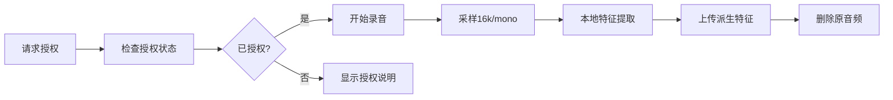
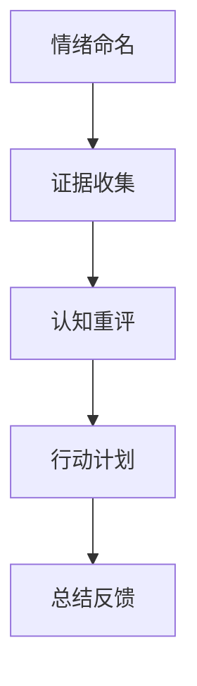
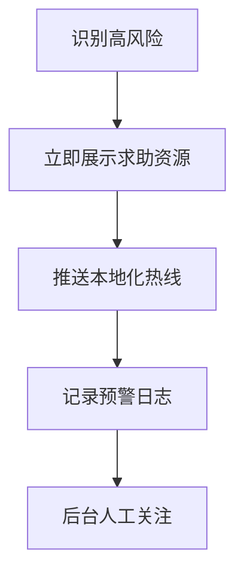
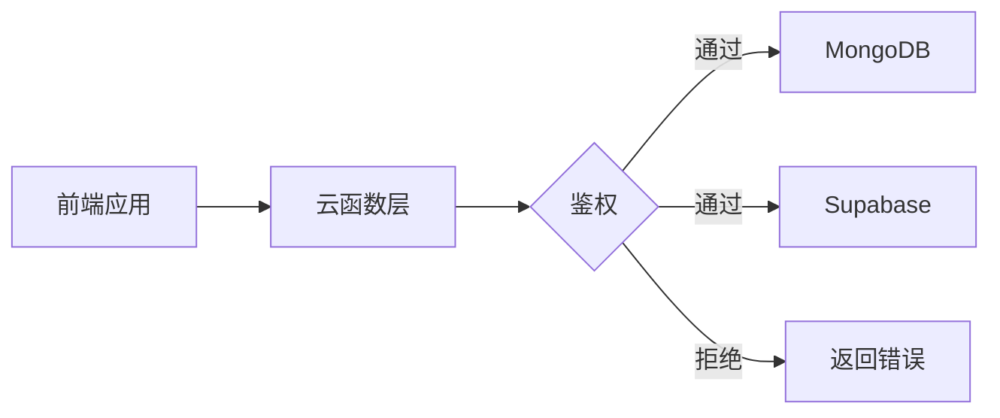
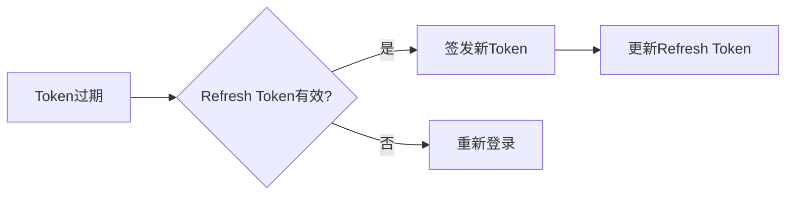
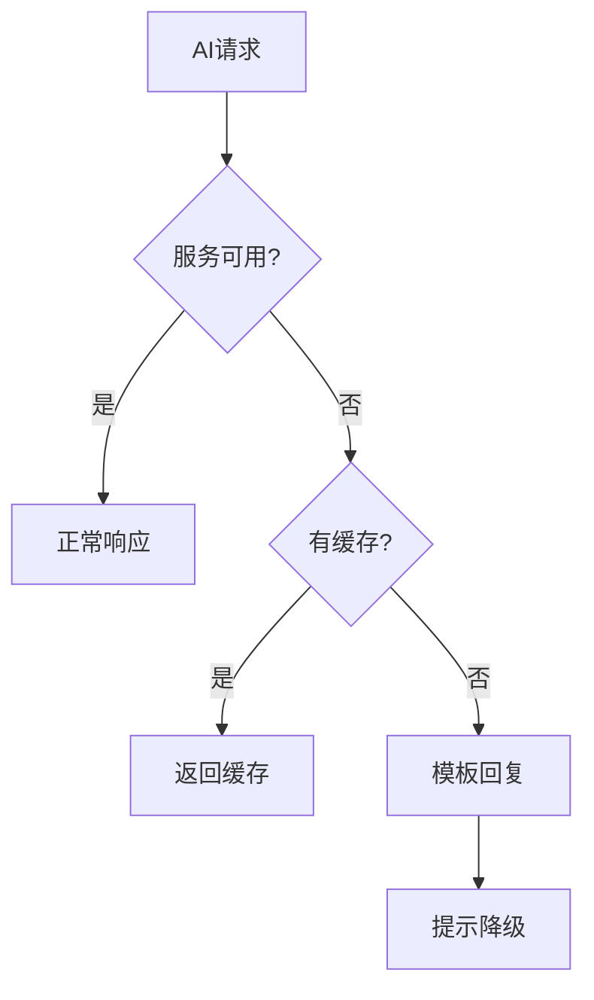

# CraneHeart 心理健康筛查与干预平台 - 需求规格说明书

## 目录

- [一、用户端需求（C端/家长端）](#一用户端需求c端家长端)
- [二、后台/管理端需求（B端）](#二后台管理端需求b端运营合规)
- [三、非功能与合规要求](#三非功能与合规nfr)
- [四、异常与失败路径](#四异常与失败路径)
- [五、时间线与里程碑](#五时间线与里程碑)
- [六、技术栈统一](#六技术栈统一)
- [七、数据职责边界](#七数据职责边界与访问路径)
- [八、安全与密钥管理](#八安全与密钥管理)
- [九、AI网关与降级](#九ai-网关与降级)

---

## 一、用户端需求（C端/家长端）

### 1.1 首次进入与同意管理

#### 1.1.1 用户协议管理

- **功能描述**：显示用户协议/隐私政策/免责声明的合并页面
- **技术要求**：记录版本号与同意时间戳
- **数据存储**：本地缓存 + 云端备份

#### 1.1.2 未成年用户管理

- **分流机制**：自动识别未成年用户
- **家长同意**：提供家长同意说明与确认流程
- **记录保存**：保存家长同意记录

#### 1.1.3 分级同意机制

| 同意级别 | 必选性 | 说明 |
|---------|--------|------|
| 文本筛查 | 必选 | 基础心理健康筛查功能 |
| 语音采集 | 可选 | 情绪声学特征分析 |
| 行为数据 | 可选 | 使用行为模式分析 |

#### 1.1.4 同意管理功能

- 查看同意记录历史
- 一键撤回所有同意
- 导出同意证明文件

### 1.2 账号与登录系统

#### 1.2.1 登录方式

- **主要方式**：微信一键登录
- **技术指标**：
  - 登录响应时间 < 1秒
  - 自动刷新 Token
  - 支持静默登录

#### 1.2.2 性能要求

- 进入首页时间 ≤ 1秒
- 页面切换无感知延迟
- 离线缓存支持

#### 1.2.3 访客模式

- 未登录可浏览公开内容
- 需要操作时引导授权
- 保存临时数据至登录后合并

### 1.3 首页与功能入口

#### 1.3.1 功能卡片布局

```text
┌─────────────────────────────────┐
│         最近评估结果展示          │
│     [继续评估] [查看详情]        │
└─────────────────────────────────┘

┌──────────┐ ┌──────────┐ ┌──────────┐
│  筛查    │ │  冥想    │ │ AI对话   │
│  测评    │ │  正念    │ │  干预    │
└──────────┘ └──────────┘ └──────────┘

┌──────────┐ ┌──────────┐ ┌──────────┐
│  CDK     │ │  反馈    │ │  更多    │
│  兑换    │ │  建议    │ │  功能    │
└──────────┘ └──────────┘ └──────────┘
```

#### 1.3.2 最近结果展示

- 显示最近一次评估结果摘要
- 提供"继续评估"快捷入口
- 展示改善趋势图表

### 1.4 文本筛查模块（PHQ-9/GAD-7）

#### 1.4.1 题库管理

- **本地渲染**：题库本地存储，离线可用
- **导航功能**：
  - 上一题/下一题按钮
  - 进度条实时显示
  - 题目跳转功能

#### 1.4.2 进度保存

- 自动保存答题进度
- 中断后可继续答题
- 支持多设备同步进度

#### 1.4.3 评分系统

- 自动计算总分
- 等级映射规则：

| 分数范围 | 风险等级 | 建议措施 |
|---------|---------|---------|
| 0-4分 | 无/轻微 | 日常关注 |
| 5-9分 | 轻度 | 自助干预 |
| 10-14分 | 中度 | 专业建议 |
| 15分以上 | 重度 | 紧急求助 |

### 1.5 语音采集模块（可选功能）

#### 1.5.1 采集流程



#### 1.5.2 技术规格

- **采样率**：16kHz
- **声道**：单声道
- **时长**：15-30秒
- **特征提取**：
  - 能量
  - 基频
  - 能量抖动
  - MFCC特征

#### 1.5.3 隐私保护

- **删除策略**：
  - 原音频不写入数据库
  - 云端缓存 ≤ 60秒
  - 任务完成立即销毁
  - 异常自动触发强制删除

#### 1.5.4 失败处理

- 端侧或云侧失败自动回退到文本路径
- 显示明确错误提示
- 不影响筛查流程继续

#### 1.5.5 审计日志

记录内容：

- 是否采集语音
- 特征提取成功/失败
- 删除完成时间戳
- 不记录原始音频或可逆数据

### 1.6 行为线索采集（匿名）

#### 1.6.1 采集内容

- **使用频次**：日/周/月统计
- **时段分布**：24小时分布图
- **完成率**：各模块完成情况
- **间隔分析**：使用间隔模式

#### 1.6.2 隐私控制

- 不包含个人身份信息（PII）
- 设置页可关闭采集
- 数据匿名化处理

### 1.7 评估结果页

#### 1.7.1 基础信息展示

- 分数（score）
- 等级（level）
- 量表ID（scaleId）
- 时间戳（timestamp）

#### 1.7.2 多模态风险评估

- 综合风险分数（riskScore）
- 风险等级（riskLevel）
- 可解释性要点说明

#### 1.7.3 建议与资源

- 专业建议文案
- 紧急求助卡片
- 自助资源推荐

#### 1.7.4 操作选项

- 重新评估
- 返回首页
- 分享结果（脱敏）

#### 1.7.5 地区化资源

- **定位服务**：
  - 获取用户位置（城市级）
  - 匹配本地资源
- **资源匹配**：
  - 本地心理热线
  - 求助机构清单
- **降级策略**：
  - 无定位时显示国家级资源
  - 提示拨打当地急救电话

### 1.8 AI个性化干预（CBT）

#### 1.8.1 干预流程



#### 1.8.2 风险联动

- 高风险用户优先显示求助资源
- 自动触发危机干预流程
- 记录干预过程

#### 1.8.3 危机处理

- **关键词拦截**：自杀、自残等危机词汇
- **资源推送**：立即展示求助资源
- **人工介入**：触发后台预警

#### 1.8.4 数据保存

- 保存情绪标签
- 保存建议摘要
- 用户可选择性保存

#### 1.8.5 地区化危机响应

- 优先展示本地化热线
- 提供一键拨打功能
- 防误触确认机制

### 1.9 冥想/正念模块

#### 1.9.1 音频播放器

- 播放/暂停控制
- 进度条拖动
- 后台播放支持
- 倍速播放（0.5x-2x）

#### 1.9.2 内容管理

- 至少2首免费曲目
- 付费内容解锁机制
- 离线下载功能

#### 1.9.3 个性化推荐

基于用户状态推荐：

- 焦虑：呼吸练习
- 压力：身体扫描
- 失眠：专注冥想

### 1.10 情绪日记

#### 1.10.1 记录功能

- 选择今日情绪标签
- 添加文字备注（200字内）
- 支持图片附件

#### 1.10.2 统计分析

- 周度情绪趋势图
- 月度情绪报告
- 情绪模式识别

### 1.11 CDK兑换系统

#### 1.11.1 输入优化

- 支持粘贴输入
- 自动格式化
- 清空/确认按钮
- 历史记录

#### 1.11.2 兑换反馈

- **成功提示**：
  - 解锁资源列表
  - 有效期说明
  - 使用指引
- **失败提示**：
  - 错误原因（不暴露规则）
  - 重试建议

### 1.12 分享与增长

#### 1.12.1 海报生成

- 心理健康贴士模板
- 个人二维码嵌入
- 多种样式选择
- 一键保存分享

#### 1.12.2 邀请系统

- 邀请码生成
- 归因事件追踪（匿名）
- 奖励机制

### 1.13 反馈与帮助

#### 1.13.1 反馈表单

| 字段 | 必填 | 说明 |
|-----|------|------|
| 标题 | 是 | 问题概述 |
| 描述 | 是 | 详细说明 |
| 联系方式 | 否 | 邮箱/电话 |
| 截图 | 否 | 问题截图 |

#### 1.13.2 反馈处理

- 自动生成工单号
- 显示预计处理时间
- 支持查询进度

### 1.14 家长门户

#### 1.14.1 数据摘要

- 近2周筛查次数
- 情绪趋势图表
- 风险预警提示

#### 1.14.2 家庭支持

- 共同练习建议
- 亲子沟通指南
- 撤回授权通道

#### 1.14.3 通知设置

- 高风险通知（可选）
- 通知文案定制
- 通知频率控制

### 1.15 设置与隐私

#### 1.15.1 同意管理

- 查看同意记录
- 分级撤回同意
- 重新授权流程

#### 1.15.2 数据采集控制

- 语音采集开关
- 行为采集开关
- 位置服务开关

#### 1.15.3 数据权限

- 导出个人数据
- 申请数据删除
- 查看数据用途

---

## 二、后台/管理端需求（B端/运营/合规）

### 2.1 兑换码管理

#### 2.1.1 兑换码生成

- 批量生成功能
- 自定义前缀/后缀
- 导入外部兑换码

#### 2.1.2 状态管理

| 状态 | 说明 | 操作 |
|-----|------|------|
| 未使用 | 可正常兑换 | 查看/编辑/删除 |
| 已使用 | 已被兑换 | 查看使用记录 |
| 已过期 | 超过有效期 | 查看/延期/删除 |
| 已禁用 | 手动禁用 | 启用/删除 |

#### 2.1.3 配置管理

- 资源集合配置
- 有效期设置
- 使用次数限制

### 2.2 内容管理系统

#### 2.2.1 冥想内容管理

- 音频上传/替换
- 上架/下架控制
- 排序权重设置
- 标签分类管理

#### 2.2.2 对话脚本管理

- 脚本版本控制
- A/B测试配置
- 回滚机制
- 审核流程

#### 2.2.3 求助资源管理

- 本地化资源配置
- 热线电话维护
- 机构信息更新
- 有效性验证

#### 2.2.4 地区化数据规范

```json
{
  "regionCode": "CN-110000",  // 国家-省-市编码
  "name": "北京市心理援助热线",
  "type": "hotline",         // hotline/institution/website
  "hours": "24小时",
  "lang": "zh-CN",
  "tel": "010-82951332",
  "verifiedAt": "2025-01-01",
  "reviewer": "admin_001"
}
```

#### 2.2.5 默认与回退策略

- 三级回退机制（市→省→国家）
- 通用紧急资源配置
- 离线资源包管理

### 2.3 量表与映射管理

#### 2.3.1 题库版本管理

- 题目增删改
- 版本发布/回滚
- 分值映射配置
- 多语言支持

#### 2.3.2 等级阈值配置

- 动态调整阈值
- 历史版本查看
- 变更审批流程
- 影响分析报告

### 2.4 用户与权限管理

#### 2.4.1 用户信息查看

- 基本资料（脱敏显示）
- 同意版本记录
- 使用行为统计
- 风险评估历史

#### 2.4.2 用户管理操作

- 账号封禁/解封
- 异常行为标记
- 申诉处理流程
- 批量操作支持

### 2.5 数据看板（匿名聚合）

#### 2.5.1 使用统计

- **用户指标**：
  - 日活/月活用户数
  - 新增用户趋势
  - 留存率分析
- **行为指标**：
  - 完成率统计
  - 使用时段分布
  - 功能使用频次

#### 2.5.2 风险监控

- 高风险用户占比
- 异常波动预警
- 地区分布热力图

#### 2.5.3 数据导出

- CSV格式导出
- 定时报表生成
- 自定义维度筛选

### 2.6 事件与日志系统

#### 2.6.1 关键事件监控

| 事件类型 | 记录内容 | 保存期限 |
|---------|---------|---------|
| 用户提交 | 时间、类型、结果 | 90天 |
| CDK兑换 | 兑换码、用户、时间 | 180天 |
| 分享行为 | 渠道、内容类型 | 30天 |
| 危机触发 | 触发词、处理结果 | 永久 |

#### 2.6.2 日志管理

- 日志脱敏展示
- 全文检索功能
- 日志归档策略
- 异常日志告警

### 2.7 通知模板管理

#### 2.7.1 通知文案配置

- 高风险通知模板
- 家长通知模板
- 系统通知模板
- 多语言版本

#### 2.7.2 通知策略

- 触发条件配置
- 发送渠道选择
- 频率限制设置
- 效果追踪分析

### 2.8 合规与审计

#### 2.8.1 同意管理审计

- 同意版本历史
- 时间戳记录
- IP地址记录
- 设备信息记录

#### 2.8.2 撤回处理

- 撤回申请处理
- 数据删除证明
- 操作日志保全
- 合规报告生成

### 2.9 增长运营工具

#### 2.9.1 海报模板编辑器

- 可视化编辑界面
- 模板库管理
- 素材资源库
- 预览与发布

#### 2.9.2 渠道归因管理

- 渠道标识配置
- 转化漏斗分析
- ROI计算报表
- 归因模型设置

### 2.10 系统配置开关

#### 2.10.1 功能开关

| 功能模块 | 开关状态 | 影响范围 |
|---------|---------|---------|
| 语音采集 | 全局开关 | 所有用户 |
| 行为采集 | 全局开关 | 所有用户 |
| 危机分流 | 分级开关 | 按风险等级 |
| AI干预 | 灰度开关 | 按比例开放 |

#### 2.10.2 配置管理

- 实时生效机制
- 配置回滚功能
- 变更通知推送
- 影响评估报告

### 2.11 版权与合规管理

#### 2.11.1 版权证明

- 授权文件上传
- 到期提醒设置
- 自动下架流程
- 侵权处理流程

#### 2.11.2 合规检查

- 定期合规审查
- 自动化检测工具
- 问题整改追踪
- 合规报告生成

---

## 三、非功能与合规（NFR）

### 3.1 性能要求

| 指标 | 要求 | 测试方法 |
|------|------|---------|
| 文本提交响应 | ≤200ms（不含网络） | 压力测试 |
| 页面加载时间 | ≤2秒 | 真机测试 |
| API响应时间 | P95 < 500ms | 监控统计 |
| 并发用户数 | 支持1000+ | 负载测试 |

### 3.2 可用性要求

- **操作简化**：主要功能 ≤ 3步完成
- **错误提示**：所有错误提示包含可执行建议
- **引导设计**：新用户引导流程
- **帮助文档**：上下文相关的帮助信息

### 3.3 可访问性要求

- **视觉设计**：
  - WCAG 2.1 AA级对比度
  - 最小字体14px
  - 色盲友好配色
- **交互设计**：
  - 触摸目标 ≥ 44px
  - 支持手势操作
  - 键盘导航支持

### 3.4 隐私保护

#### 3.4.1 数据最小化原则

- 仅采集必要数据
- 语音仅存派生特征
- 定期清理过期数据

#### 3.4.2 数据加密

- 传输加密：全链路TLS
- 存储加密：AES-256
- 密钥管理：定期轮换

### 3.5 日志规范

#### 3.5.1 日志格式

```text
[时间戳] [级别] [模块] [用户ID(脱敏)] [操作] [结果] [耗时]
```

#### 3.5.2 脱敏规则

- 手机号：保留前3后4位
- 姓名：仅显示姓氏
- 密钥：完全不记录
- IP：保留前两段

### 3.6 用户权利保障

#### 3.6.1 数据权利

- **访问权**：查看所有个人数据
- **更正权**：修改错误信息
- **删除权**：申请删除账号和数据
- **导出权**：导出个人数据副本

#### 3.6.2 退出机制

- 一键退出所有授权
- 数据删除确认流程
- 删除完成通知

### 3.7 合规声明

- **医疗声明**：仅提供心理健康筛查，不构成医疗诊断
- **年龄限制**：未成年人需家长同意
- **数据用途**：明确说明数据使用目的
- **第三方共享**：不与第三方共享个人数据

---

## 四、异常与失败路径

### 4.1 中断恢复

#### 4.1.1 答题中断

- **场景**：用户在答题过程中退出
- **处理**：
  - 自动保存当前进度
  - 首页显示继续入口
  - 保留7天有效期

#### 4.1.2 支付中断

- **场景**：CDK购买支付失败
- **处理**：
  - 保留订单30分钟
  - 支持重新支付
  - 自动退款机制

### 4.2 功能降级

#### 4.2.1 语音功能失败

- **触发条件**：
  - 录音权限被拒绝
  - 特征提取失败
  - 网络上传超时
- **降级方案**：
  - 自动切换文本路径
  - 显示降级提示
  - 不影响评估流程

#### 4.2.2 AI服务不可用

- **触发条件**：
  - API调用失败
  - 响应超时
  - 内容审核拦截
- **降级方案**：
  - 使用预设模板回复
  - 提供离线资源
  - 引导人工客服

### 4.3 危机处理

#### 4.3.1 高风险识别

- **触发条件**：
  - 评分超过阈值
  - 命中危机关键词
  - 行为模式异常
- **处理流程**：



### 4.4 离线支持

#### 4.4.1 断网场景

- **基础功能**：
  - 离线自助手册
  - 呼吸练习器
  - 已下载的冥想音频
- **数据同步**：
  - 本地缓存队列
  - 恢复网络后自动上传
  - 冲突解决机制

### 4.5 权限处理

#### 4.5.1 拒绝同意

- **影响范围**：
  - 仅开放浏览模式
  - 无法使用核心功能
  - 显示功能限制说明
- **引导策略**：
  - 说明数据用途
  - 提供最小权限选项
  - 支持分级同意

---

## 五、时间线与里程碑

### 5.1 项目基线

- **M0 基线日期**：2025-10-20（周一）
- **总体工期**：14周
- **目标上线**：2026-01-23

### 5.2 分期计划

#### M0：基线对齐（2025-10-20 ～ 2025-10-24）

**为期**：1周

**交付物**：

- [ ] 需求文档定稿
- [ ] 技术栈确认
- [ ] 数据模型设计
- [ ] 接口文档v1.0

#### M1：MVP核心功能（2025-10-27 ～ 2025-11-21）

**为期**：4周

**核心功能**：

- [ ] 用户注册/登录
- [ ] 同意管理
- [ ] 量表评估（PHQ-9/GAD-7）
- [ ] 结果展示页
- [ ] AI干预基础版
- [ ] CDK兑换

**验收标准**：

- 功能完整度 > 90%
- 单元测试覆盖率 > 80%
- 接口文档完成

#### M2：合规与安全（2025-11-24 ～ 2025-12-12）

**为期**：3周

**安全功能**：

- [ ] 密钥管理系统
- [ ] 数据加密实施
- [ ] 日志审计系统
- [ ] 地区化资源配置
- [ ] 失败路径完善
- [ ] 隐私合规检查

**验收标准**：

- 安全扫描无高危漏洞
- 合规检查通过
- 压力测试达标

#### M3：运维与看板（2025-12-15 ～ 2026-01-09）

**为期**：4周

**运维功能**：

- [ ] 匿名数据看板
- [ ] 配额告警系统
- [ ] AI网关监控
- [ ] 降级策略实施
- [ ] 运维工具集
- [ ] 监控大屏

**验收标准**：

- 监控覆盖率 > 95%
- 告警响应时间 < 5分钟
- 自动化运维脚本完成

#### M4：GA验收（2026-01-12 ～ 2026-01-23）

**为期**：2周

**验收内容**：

- [ ] 全功能回归测试
- [ ] 性能基准测试
- [ ] 崩溃率检测（< 0.1%）
- [ ] 发布流程演练
- [ ] 回滚机制验证
- [ ] 用户验收测试

**Go/No-Go评审标准**：

- 性能指标达标
- 崩溃率 < 0.1%
- P0/P1缺陷清零
- 合规审查通过

### 5.3 同步机制

- **每日站会**：09:30 同步进度
- **周报**：每周五提交
- **里程碑评审**：每阶段结束
- **风险评估**：双周更新

---

## 六、技术栈统一

### 6.1 前端技术栈

#### 6.1.1 框架选择

- **UI框架**：uView 2.x（基于uni-app）
- **核心版本**：Vue 2.6 + Options API
- **注意事项**：
  - 不得与uni-ui混用
  - 组件替换需说明差异
  - 样式回归测试必须

#### 6.1.2 开发规范

```javascript
// 组件命名规范
components/
  ├── common/        // 通用组件
  ├── business/      // 业务组件
  └── layouts/       // 布局组件

// 文件命名：kebab-case
// 组件命名：PascalCase
// 方法命名：camelCase
```

### 6.2 后端技术栈

#### 6.2.1 运行环境

- **Node版本**：16 LTS
- **模块系统**：CommonJS
- **云服务**：uniCloud-aliyun
- **数据库**：MongoDB + Supabase

#### 6.2.2 版本控制

```json
{
  "engines": {
    "node": ">=16.0.0 <17.0.0",
    "npm": ">=7.0.0"
  }
}
```

### 6.3 回滚策略

#### 6.3.1 版本管理

- Git标签管理
- 版本回滚脚本
- 配置回滚机制
- 数据回滚方案

#### 6.3.2 风险清单

| 组件 | 风险点 | 缓解措施 |
|-----|--------|---------|
| UI框架 | API不兼容 | 适配层封装 |
| Node版本 | 依赖冲突 | 锁定版本 |
| 云服务 | 服务中断 | 多区域部署 |

---

## 七、数据职责边界与访问路径

### 7.1 数据库职责划分

#### 7.1.1 MongoDB（uniCloud）

**负责数据**：

- 用户信息
- 评估记录
- 筛查结果
- 干预历史
- CDK管理

**访问方式**：

- 仅通过云函数访问
- 实施最小权限原则
- 敏感操作需审计

#### 7.1.2 Supabase

**负责数据**：

- 用户反馈
- 运营数据聚合
- 审计日志
- 统计报表

**访问限制**：

- 服务端专用（service_role）
- 前端禁止直连
- 通过云函数中转

### 7.2 访问路径设计



### 7.3 数据同步策略

#### 7.3.1 同步原则

- 默认不进行双写
- 异步ETL同步
- 最终一致性保证

#### 7.3.2 ETL配置

```javascript
// 定时任务配置
{
  "schedule": "0 2 * * *",  // 每天凌晨2点
  "source": "MongoDB",
  "target": "Supabase",
  "fields": ["uid", "score", "level", "timestamp"],
  "strategy": "incremental"  // 增量同步
}
```

### 7.4 数据字典统一

#### 7.4.1 核心字段定义

| 字段名 | 类型 | 说明 | 示例 |
|--------|------|------|------|
| uid | String | 用户唯一标识 | "u_1234567890" |
| consentVersion | String | 同意版本 | "1.0.0" |
| riskLevel | Integer | 风险等级 | 1-4 |
| scaleId | String | 量表标识 | "PHQ-9" |
| score | Integer | 得分 | 0-27 |
| timestamp | Long | 时间戳 | 1634567890000 |

---

## 八、安全与密钥管理

### 8.1 密钥管理体系

#### 8.1.1 密钥存储

- **位置**：uniCloud环境变量/KMS
- **原则**：
  - 服务端独占
  - 定期轮换（90天）
  - 分级管理

#### 8.1.2 密钥分类

| 类型 | 用途 | 轮换周期 | 权限级别 |
|-----|------|---------|---------|
| API密钥 | 第三方服务 | 90天 | 服务端 |
| 加密密钥 | 数据加密 | 180天 | KMS |
| 签名密钥 | 请求签名 | 30天 | 服务端 |

### 8.2 加密策略

#### 8.2.1 传输加密

- 全链路TLS 1.2+
- 证书固定（Certificate Pinning）
- HSTS强制启用

#### 8.2.2 存储加密

```javascript
// 字段级加密示例
{
  "phone": encrypt(plainPhone, fieldKey),
  "email": encrypt(plainEmail, fieldKey),
  "name": encrypt(plainName, fieldKey)
}
```

### 8.3 Token管理

#### 8.3.1 生命周期

- **Access Token**：2小时
- **Refresh Token**：7天
- **撤销机制**：立即失效

#### 8.3.2 刷新策略



### 8.4 审计要求

#### 8.4.1 审计内容

- 同意/撤回操作
- 批量数据操作
- 敏感信息访问
- 配置变更

#### 8.4.2 审计格式

```json
{
  "timestamp": "2025-10-20T10:00:00Z",
  "operator": "admin_001",
  "action": "consent.revoke",
  "target": "user_12345",
  "result": "success",
  "ip": "192.168.1.1",
  "device": "web"
}
```

---

## 九、AI 网关与降级

### 9.1 网关架构

#### 9.1.1 适配层设计

```javascript
// 统一请求格式
{
  "model": "gpt-4",
  "prompt": "...",
  "temperature": 0.7,
  "maxTokens": 1000,
  "userId": "...",
  "sessionId": "..."
}

// 统一响应格式
{
  "content": "...",
  "model": "gpt-4",
  "usage": {
    "promptTokens": 100,
    "completionTokens": 200,
    "totalCost": 0.01
  },
  "latency": 1234
}
```

#### 9.1.2 多模型支持

| 模型 | 优先级 | 场景 | 成本 |
|------|--------|------|------|
| GPT-4 | 1 | 复杂对话 | 高 |
| GPT-3.5 | 2 | 常规对话 | 中 |
| 本地模型 | 3 | 降级场景 | 低 |

### 9.2 限流与配额

#### 9.2.1 限流策略

- **用户级**：100次/小时
- **全局级**：10000次/小时
- **突发控制**：令牌桶算法

#### 9.2.2 配额管理

```javascript
// 配额告警阈值
{
  "warning": 0.8,   // 80%触发预警
  "critical": 0.95, // 95%触发限流
  "block": 1.0      // 100%完全阻断
}
```

### 9.3 降级策略

#### 9.3.1 触发条件

- API响应超时（>10s）
- 错误率超标（>10%）
- 配额耗尽
- 内容安全拦截

#### 9.3.2 降级方案



### 9.4 版本管理

#### 9.4.1 Prompt版本控制

```javascript
// Prompt版本管理
{
  "version": "1.0.0",
  "prompt": "...",
  "createdAt": "2025-10-20",
  "createdBy": "admin",
  "status": "active",
  "rollbackTo": "0.9.0"
}
```

#### 9.4.2 回滚机制

- 一键回滚到稳定版本
- 灰度发布支持
- A/B测试能力
- 效果对比分析

---

## 附录A：缩略词表

| 缩写 | 全称 | 说明 |
|------|------|------|
| CBT | Cognitive Behavioral Therapy | 认知行为疗法 |
| CDK | Code Activation Key | 激活码 |
| PHQ-9 | Patient Health Questionnaire-9 | 抑郁筛查量表 |
| GAD-7 | Generalized Anxiety Disorder-7 | 焦虑筛查量表 |
| PII | Personally Identifiable Information | 个人身份信息 |
| MFCC | Mel-frequency Cepstral Coefficients | 梅尔频率倒谱系数 |
| KMS | Key Management Service | 密钥管理服务 |
| ETL | Extract, Transform, Load | 数据抽取转换加载 |
| NFR | Non-Functional Requirements | 非功能性需求 |
| ROI | Return on Investment | 投资回报率 |

## 附录B：参考文档

1. 《个人信息保护法》相关条款
2. 《网络安全法》合规要求
3. 《未成年人保护法》相关规定
4. WCAG 2.1 无障碍设计指南
5. ISO 27001 信息安全管理体系

## 附录C：联系方式

- 产品负责人：[待定]
- 技术负责人：[待定]
- 运维负责人：[待定]
- 合规负责人：[待定]

---

**文档版本**：v1.0.0  
**更新日期**：2025-10-20  
**下次评审**：2025-10-24
